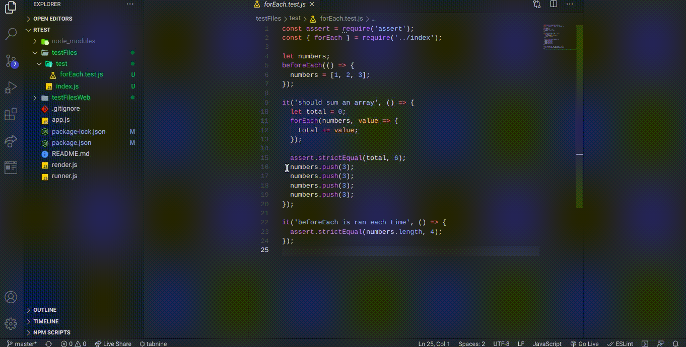

<h1 align='center'>RTEST - TESTING FRAMEWORK</h1>

<p align='center'></p>

**RTEST** is a testing framework for javascript files. It is implemented in javascript and it follows a tree structure for searching the test files. This framework will only work for test files with ```.test.js``` extension.

### Installation
Steps to install this framework - 
1. Clone this repo. - ```git clone https://github.com/pranjals149/RTest-Testing-Framework.git```
2. After cloning this repo. install the dependencies used in the project by typing ```npm i``` in your terminal. 
3. Now, you can use this framework anywhere on your system.
3. Remember to use this framework only on a trustable source.

### Usage
After installing open your terminal and just type ```rtest``` to run the framework. It will search for test files having extensions as ```.test.js``` in the whole directory and perform testing on it.

### Screenshot


**Warning - Only use this framework on a trustable directory. Avoid using this on a untrustable source (i.e the files downloaded from the internet.)**
